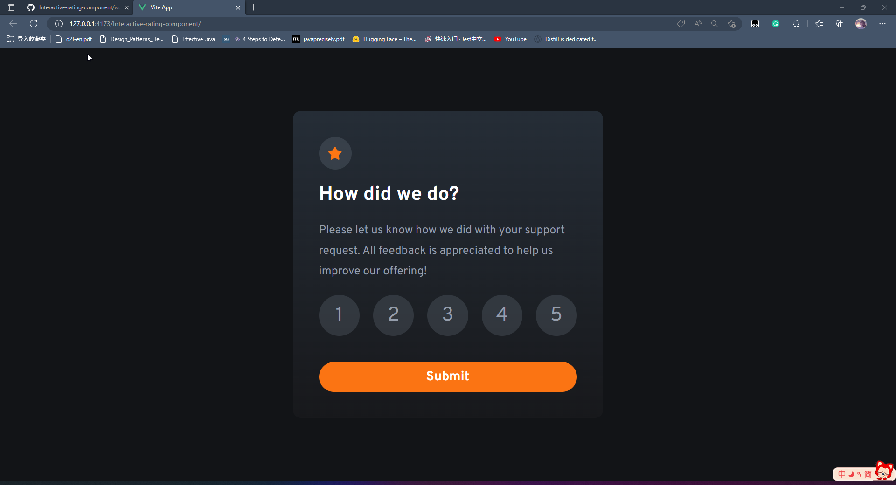

# Frontend Mentor - Interactive rating component solution

This is a solution to the [Interactive rating component challenge on Frontend Mentor](https://www.frontendmentor.io/challenges/interactive-rating-component-koxpeBUmI). Frontend Mentor challenges help you improve your coding skills by building real projects. 

## Table of contents

- [Frontend Mentor - Interactive rating component solution](#frontend-mentor---interactive-rating-component-solution)
  - [Table of contents](#table-of-contents)
  - [Overview](#overview)
    - [The challenge](#the-challenge)
    - [Screenshot](#screenshot)
    - [Links](#links)
  - [My process](#my-process)
    - [Built with](#built-with)
    - [What I learned](#what-i-learned)
  - [Acknowledgments](#acknowledgments)

## Overview
In this challenge, I was tasked with creating a rating component that would allow users to select a rating and submit it. The component would then display a "Thank you" card with the user's rating.
* I used Vue 3 framework to create this component.

> This is my first time using Vue 3 and I'm still learning it. I'm sure there are better ways to do this, but this is what I came up with.
### The challenge

Users should be able to:

- View the optimal layout for the app depending on the device's screen size
- See hover states for all interactive elements on the page
- Select and submit a number rating
- See the "Thank you" card state after submitting a rating

### Screenshot

### Links

- Solution URL: [solution URL: GitHub repository](https://github.com/pzq123456/Interactive-rating-component)
- Live Site URL: [GitHub pages live demo site](https://pzq123456.github.io/Interactive-rating-component/)

## My process

### Built with

- Semantic HTML5 markup
- CSS custom properties
- Flexbox
- CSS Grid
- Mobile-first workflow
- [Vue 3](https://v3.vuejs.org/) - JS library

### What I learned

I learned how to use Vue 3 to create a component. I also learned how to use the `v-model` directive to create a two-way binding between the component and the parent component. I also learned how to use the `v-if` directive to conditionally render elements.

## Acknowledgments
Thanks to the [video](https://www.youtube.com/watch?v=iG0HZ6_vgjs) by [John Komarnicki](https://www.youtube.com/@JohnKomarnicki) for teaching me how to use Vue 3. I learned a lot from that video.

* Thanks to [Frontend Mentor](https://www.frontendmentor.io) for providing this challenge. I learned a lot from this challenge and I'm looking forward to more challenges from them.

